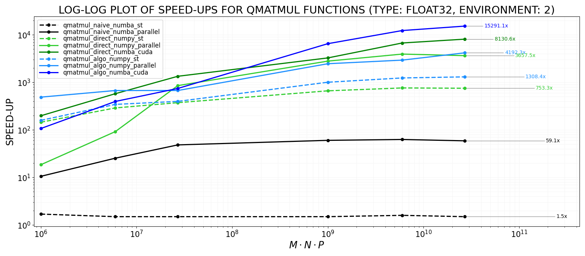
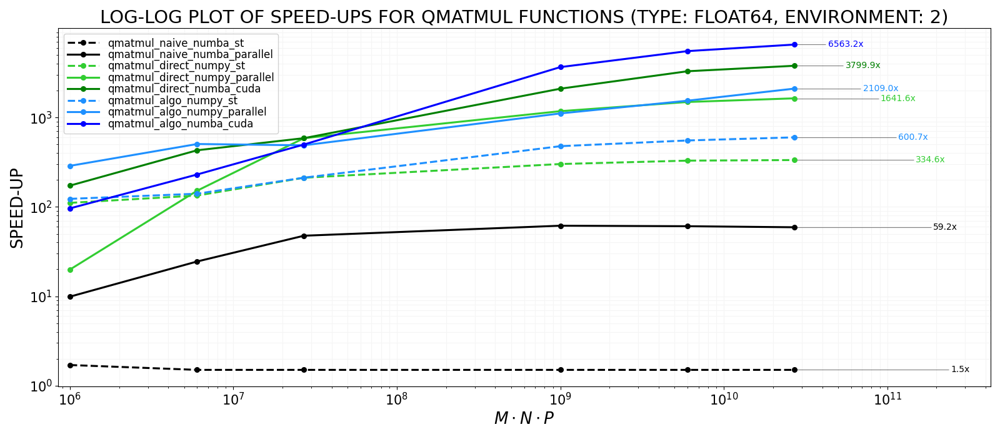

# qmatmul: Fast multiplication of quaternion-valued matrices - algorithm and its implementations for sequential and CUDA computation
We present an algorithm for fast multiplication of matrices whose elements are *quaternions* - hypercomplex numbers consisting of one real and three imaginary parts.
The number of elementary floating-point multiplications involved in the algorithm is reduced *twice* with respect to the definition-based formula, 
regardless of the input matrices. This is owed to a suitable representation and decomposition into two products, one of which takes advantage of certain 
diagonal symmetry properties, the other of sparsity. `qmatmul` contains eight implementation variants, covering: CPU-based single-threaded and parallel
computations, and also GPU/CUDA-based multi-threaded ones. Our design of CUDA computations for the proposed algorithm involves: six kernel functions 
with eleven invocations, suitable usage of tiling and shared memory, and few host-device memory transfers.

## Selected kernels - flows of CUDA computations
<table>
   <tr>
     <td valign="top"></td>
     <td valign="top"></td>    
   </tr>
</table>

## Speed-ups
<table>
   <tr>
     <td valign="top"></td>
     <td valign="top"></td>    
   </tr>
</table>

## Installation
TODO

## Example usage 
With `qmatmul` module installed, one can write e.g.:
```python
import qmatmul as qmm
import numpy as np
import time

print("QMATMUL EXAMPLE...")
M, N, P = 1000, 3000, 2000
np.random.seed(0)
A = np.random.rand(M, N, 4) # M x N matrix of quaternions
B = np.random.rand(N, P, 4) # N x P matrix of quaternions
t1 = time.time()
C = qmm.dot(A, B)
t2 = time.time()
print(f"RESULT FRAGMENT -> C[:3, :3]:")
print(C[:3, :3])
print(f"QMATMUL EXAMPLE DONE. TIME OF qmm.dot: {t2 - t1:.6f} s.")
```
Running the script above produces the following output:
```bash
QMATMUL EXAMPLE...
RESULT FRAGMENT -> C[:3, :3]:
[[[-1528.6768062   1482.01579334  1482.64352966  1469.29588132]
  [-1474.39555984  1485.26884228  1485.81638515  1486.03433938]
  [-1459.21558118  1487.12054919  1468.20437822  1461.65795584]]

 [[-1502.50516591  1465.24326325  1494.5907814   1503.74503685]
  [-1472.32677282  1493.41728185  1487.01751106  1506.41597882]
  [-1460.42240679  1488.1077977   1474.34164258  1504.36179871]]

 [[-1558.07311493  1475.34714296  1475.731701    1495.41197899]
  [-1528.83559572  1476.28138065  1474.62854662  1504.35168932]
  [-1508.66904595  1501.06439708  1459.07714887  1471.97545486]]]
QMATMUL EXAMPLE DONE. TIME OF qmm.dot: 0.209159 s.
```

An optional argument `approach_name` of the function `qmm.dot` allows 
the user to select one of the following eight computational approaches: 
`"naive_st"`, `"naive_parallel"`, `"direct_numpy_st"`, 
`"direct_numpy_parallel"`, `"direct_numpy_st"`, `"direct\_cuda"`,
`"algo_numpy_st"`, `"algo_numpy_parallel"`, `"algo_numba_cuda"`.
The default setting is `"algo_numba_cuda"`.

## Documentation
TODO

## License
This project is licensed under the [MIT License](https://opensource.org/licenses/MIT).

## Acknowledgments and credits
- [Numba](https://numba.pydata.org): a high-performance just-in-time Python compiler.
